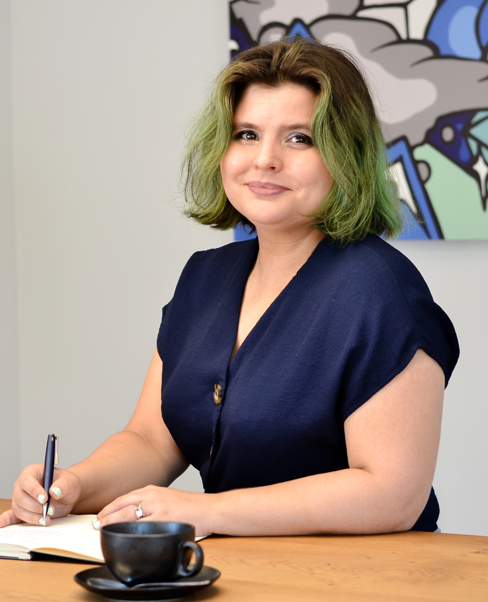

?> Last updated: 5 November 2023

?> I am eligible to work anywhere in the EU/EFTU without a visa.

## Personal note

</IMG>

I am a medical researcher, data scientist, and data solutions developer with a clinical medical degree, postgraduate research degree and over two years' experience in data science and solutions development with a health analytics startup.

### Education  

I was drawn to academic research in neuroscience and neuropsychiatry before starting my university education, and considered a medical degree to be a holistic path to study neuroscience and pathophysiology in the brain. I took the opportunity offered by my university to complete a postgraduate biosciences degree between my third and fourth years of my clinical studies, where I was exposed to a range of wet-lab techniques

My dissertation project primarily focused on exploring differential protein concentrations in mouse hippocampi using western blots and immunohistochemistry (brightfield and confocal), among other techniques, to describe inflammation, neurogenesis and blood-brain-barrier permeability. I continued with the project during my remaining years at medical school to develop a paper based on this work.

At the University of Cape Town, the sixth and final year of a clinical medical degree is considered a 'student internship'. During this time, working in some of the most functional public sector facilities in an extremely dysfunctional health system. I realised that it would be almost impossible to effect change from inside the system, and that continuing as a clinician in that environment would lead very quickly to burnout and the loss of empathy and curiosity.

### Experience  

After graduating from medical school at the end of 2020, while looking for PhD opportunities in Sweden, I worked on a research project remotely offered by Uppsala University. The work was focused on analysing survey data, and I became very aware that the statistical techniques commonly employed by the biomedical sciences are oversimplistic, outdated, and inadequate for addressing the high dimensionality and complexity of the biological systems. 

I started teaching myself more advanced dimension reduction and regression techniques, and shifted to working with python libraries for analysis and visualisation. I was interested in building my data science skills, and therefore accepted a position at Wimmy (Pty) Ltd, a health analytics startup that I have worked at for the last two years.

The brainchild of an epidemiologist, Wimmy has core competencies in biostatistics and infectious disease modelling. For the first 18 months, I worked primarily on exploratory data analyses, project scoping, analysis planning and assisting with the development and application of machine learning models. However, most of our clients require packaged solutions, for example, live interactive dashboards, data pipelines or electronic health record databases. Because there was a lack of existing internal expertise, I developed the necessary DevOps, CI/CD and Cloud (primarily Azure) competencies to design and implement these solutions, as well as liaise with clients' in-house technical teams. While this work is stimulating and challenging, I wish to return to more clinically relevant work in the public and academic sectors, and/or work on data infrastructure that spans across organisations, institutions and countries, in an environment of increased oversight, test-driven development, and system regulation.

### Career goals  

My ultimate career goal is to advance global health with contributions to an evidence base through the elucidation of pathophysiological pathways in complex syndromic disorders, (with a soft spot for neuropsychiatry and neuropsychoimmunology), focusing on linking biomarkers to clinical presentations.

I feel that large datasets of diverse patient cohorts combined with ML/DL techniques can lead to new insights by minimising selection bias introduced through syndromic patient classifications

I would love to work on any/some combination of the following:  
- the research, analytics and modelling itself (including how to select and adapt relevant models for the additional reliability and clarity required in the health care setting),  
- the development and maintenance of reliable research data infrastructure/biobanking, data engineering and data provisioning  
- higher-level project scoping for data needs and output formats required by researchers and clinicians  

### Values

I place huge value in communal knowledge through good scientific communication with experts and non-experts alike. I feel that the translation of research from the lab to the clinical environment is also of great importance – which includes ensuring that models are reliable, rigorous, transparent and valid. 

I am highly adaptable and outcomes driven, and I enjoy working in a team to try to digest large problem spaces. I believe my experience and insights into data science, health sciences and tech development within corporate, public, and academic sectors would be an asset to the project.

## Education

### Degrees and diplomas

+ Degree: MBChB +

  > University of Cape Town (2020)  
  > Language of instruction: English

    - 2014-2016: years 1-3 of the MBChB medical degree ("bioscience years")
        - 2015: 4 week 'special studies' based on an original research question and self-devised research plan on
          eHealth and mHealth
          in South African mental health care.
        - 2016: Additional “Molecular Medicine” course (for acceptance into BMedSci programme)
            - an introduction to modern bioscientific methods and the philosophy of science
            - an introduction to bioinformatics and data analysis
            - participation in journal clubs
            - genetics and genomics
            - hands-on experience with plasmid vectors and DNA extraction, (q)PCR and NGS and flow cytometry, western
              blotting
    - 2018-2020: years 4-6 of the MBChB medical degree ("clinical years"), including rotations through various
      specialities
        - 2019: 2-week elective in consultation-liaison psychiatry with Groote Schuur Hospital’s Psychiatry Department

+ Degree: BMedSci (Hons) (Phys) +

  > University of Cape Town (2017) - Awarded in the first class  
  > Specialising in physiology and neuroscience  
  > Language of instruction: English

    - Feb - June 2017: course work
        - Scientific communication
            - basic statistics
            - philosophy of science
            - conducting literature reviews
        - Introduction to the nervous system and neuroanatomy
        - The central stress network and top down self-regulation
        - Physiology and pharmacology of excitable cells
        - Degeneration and regeneration in the nervous system

    - July - Nov 2017: project with dissertation.
        - dissertation title: *Neuroinflammation in peripherally helminth-infected mice: exploring mechanisms of
          behaviour change in
          a chronic inflammatory model.*
        - Literature review
        - Development of research plan
        - Ethics application
        - Experimentation: western blots (calorimetric and chemiluminescent), immunohistochemistry (confocoal and DAB bright-field), Evans Blue BBB permeability assay. 
        - Dissertation write-up
        - Presentation

+ School-leaving National Senior Certificate +

  > Fish Hoek High School (2013)  
  > Language of instruction: English

    - Subjects 
        - English Home Language
        - Afrikaans Home Language
        - French Second additional language
        - Mathematics
        - Life Orientation
        - History
        - Music
        - Physical Sciences

### Additional educational courses  

+ Research Project in Neuroscience +

  > Uppsala University (remote)    
  > Course code 3NR230 
  > 18 Jan - 6 June 2021  
  > 30 ECTS credits 
  > Language of submission: English  

    - Feb - June 2017: course work
    - Dissertation title: *Profiling lockdown adherence and poor coping responses towards the COVID-19 crisis in an
      international cross-sectional servey*
    - Main subject / occupational skills covered :
        - Analysing survey response data
        - Wilcoxon rank-sum and signed-rank tests, chi-squared tests, t-tests, ANOVAs, MANOVAs, linear regressions
        - principal component analysis and K means clustering 

+ Mathematics for Machine Learning: Linear Algebra +

  > [Coursera Course](https://www.coursera.org/learn/linear-algebra-machine-learning)  
  > October 2021  
  > Offered by Imperial College London

    - 5-week course. Covered linear algebra, matrix transformations, eigenvalues and eigenvectors

+ Techniques in Neuroscience +
  > The International Brain Research Organization (IBRO)-UCT African Advanced School on Techniques in Neuroscience  
  > 2-18 December 2017  
  > Language of instruction: English

    - EEG demonstrations/neurosurgery & epilepsy lectures at Red Cross Children's Hospital
    - analysing rodent behaviour
    - immunohistochemistry practical
    - stereology lectures
    - optogenetics and calcium imaging exposure. Whole-cell patch clamping and interface chamber practicals.
    - electrophysiology prac: [Backyard Brains SpikerBox](https://backyardbrains.com/products/spikerbox)
    - Poster presentations

+ Swedish A2 Distance Live +
   > [Folkuniversitetet](https://www.folkuniversitetet.se/)  
   > Language of instruction: Swedish  

## Experience

+ Medical Data Solutions Scientist +
    
   <b>Wimmy (Pty) Ltd</b>  

  > May 2023 – December 2023
    - Working with medical specialists and the health product owner to translate the client needs into a scoped plan of analysis, identifying key health-related project outcomes.
    - Scoping and prototyping development of full-stack solutions for live client-facing dashboards
    - Providing the client with technical roadmaps and updates, scope realignment, communication of dependencies and dependency resolution with client technical teams.
    - Adapting extract-load-transform processes and cloud infrastructure to handle diverse client data sources and output requirements

+ Data Scientist +
    
   <b>Wimmy (Pty) Ltd</b>  

  > January 2022 - April 2023
  > Oct - Dec 2021: Intern
    - Conducting literature searches and reviews of medical and statistical knowledge bases
    - Initial data wrangling and exploratory data analyses
    - Assisting in ML model development and deployment (e.g. LSTM RNNs), including critical analysis of model choice and liaising between data and health professionals
    - development of demo dashboards
    - Critically evaluating analysis outputs and developing visualisations and graphs, presentations and written reports to convey clear. intelligible insights and action points for the client
    - Working with longitudinal health data

+ Teaching assistant +
    
  <b>University of Cape Town </b> 

    > 2017
    - Providing lectures on neuroanatomy for MBChB students
    - Demonstrating at practicals for MBChB students
    - Assisting with marking

+ Student-intern clinician +
    
  <b>University of Cape Town </b> 

    > 2020
    - Tertiary and secondary hospitals
    - assisting with patient intake and initial clerking, daily patient assessment management, ward-based procedures, theatre assistance. 
    - In acute care, general, paediatric, obstetric, neonatal, psychiatric and surgery departments.
    - Day clinic and primary care work
    - 2-week elective in consultation-liaison psychiatry

## Publications

- Van Belle S, de Lange A, Tomes H, Lucas R, Naidoo V, Raimondo JV. Peripheral Taenia infection increases
  immunoglobulins in
  the central nervous system. Int J Parasitol. 2021021 Jul;51(8):685-692. doi: 10.1016/j.ijpara.2020.12.008 PMID:
  [33753094](https://pubmed.ncbi.nlm.nih.gov/33753094/)
- *Unpublished, [available on MedRχiv](https://www.medrxiv.org/content/10.1101/2021.07.21.21260910v1)* Van Belle SC,
  Dahlén A,
  Schiöth HB, Brooks SJ. Profiling lockdown adherence and poor coping responses towards the COVID-19 crisis in an  
  international cross-sectional survey.
- *Conference paper* Van Belle S, Van Belle JP, & Weimann E, 2017, A South African mHealth App for Depression Screening
  and
  Management. ACIST, Cape Town, 10th – 11th July 2017. *Proceedings have not been uploaded, see
  [programme](http://www.acist2017.uct.ac.za/Downloads/ACIST2017%20-%20Conference%20Programme_V4.pdf),
  [paper](https://www.researchgate.net/publication/344453865_A_South_African_Mhealth_App_for_Depression_Management_and_Treatment_a_Survey_and_Requirements_Analysis_1)
  , and
  [original thesis](https://www.researchgate.net/publication/334735913_mHealth_and_eHealth_in_South_Africa)*

## Skills and technologies

### Data science and statistics

- data quality assessment
- multi-dimensional real-world data wrangling and data modellings
- critically determining test suitability and validity, and exploring more appropriate solutions
- techniques:
    - significant exposure
        - Wilcoxon rank-sum and signed-rank tests, chi-squared tests, t-tests, ANOVAs, MANOVAs, linear regressions
        - principal component analysis and K means clustering
    - brief hands-on exposure
        - spacial data analysis
        - structural equation modelling
        - grid-search hyperparameter tuning
        - conducting semi-structured interviews
        - manual (non-ML) thematic analysis
        - comparison of ML model outputs wrt statistical validity as well as clinical value
    - theoretical understanding
        - LSTM RNNs
        - logistic regressions and random forest classifiers
        - agent-based modelling

- Data engineering (Azure Databricks)
  - Data pipelining including multiple SQL-based sources
  - record deduplication
  - multi-field record reconciliation
  - database modelling
  - sanitisation of SQL queries (Pypika)
  - Setup of new Azure Databricks account + workspaces, including GitHub integration, crediential management for blob storage access, etc.

- Technologies
    - Python:
        - jupyter notebooks
        - numpy, pandas, scikit-learn, tensorflow, keras-tuner
        - matplotlib, seaborn, plotly
        - mysql connectors and query builders (for query santisation), e.g. mysqlclient, pypika
    - R: non-fluent, can understand and modifty R code
    - Azure Machine Learning
    - SPSS, GraphPad Prism, ImageJ, MS Excel

### DataOps, DevOPs, Software engineering

Experience and experimentation with:

- SAAS development
    - Python: Dash (dash.plotly) (built on Flask)
    - CSS, html, Bootstrap components
    - Graphana
    - JavaScript (some experimentation with Google APIs in mid 2020)
- Code environment, documentation and version management:
    - GitHub, Azure DevOps
    - conda
    - development of python packages
    - assisting colleagues with local coding evironment set-up
    - config files (yaml, json)
- Deployment
    - Docker
    - GitHub Actions
    - ghcr.io
    - Azure container registeries
    - Azure container apps
- Data flow pipelines
    - Azure MySQL servers, Azure Data Factory

### Communication

- languages
    - English (Primary home language)
    - Dutch (Secondary home language)
    - Afrikaans (fluent non-home language)
    - French (very rusty conversational - high school)
    - Swedish (CEFR level A2 - 2022)

- scientific communication
    - conducting literature searches, summaries and reviews
    - writing ethics applications
    - writing academic dissertations and articles
    - formulation of written, graphical and oral data stories to convey coherent, intelligable insights to laypeople and
      experts
    - lecturing and responding to student questions
    - hosting scientific talks with guest speakers

### Clinical medicine

> predominantly 2018-2020

- significant exposure
    - history taking, system-specific and general examination, assessment and management plan formulation for most
      common illness
      presentations
    - accessing clinical resources and practice guidelines
    - pharmaceutical dose calculation and administration
    - interpretation of common lab and imaging results
    - presenting cases and writing clinical notes, referrals and discharge summaries
    - venepuncture, arterial blood sampling, manual blood-pressure monitoring, IM injections, IV canulation, urethral
      catheterisation, lumbar punctures
    - advanced life support training (course work, no formal certification)

- brief exposure
    - theatre assistance (including caesarean sections), tracheal intubation and ventilation, continuous and interrupted
      suturing
    - labour monitoring, vaginal deliveries
    - nasogastric tube insertion (paediatric), fine needle aspiration, administration of local anaesthetic, chest drain
      insertion
    - active resuscitation (DKA, hyperkalaemia, submassive pulmonary embolus, severe hypothyroidism)
    - dislocation reduction, ophthalmoscopy and other speciality-specific techniques.

### Wet-lab

> predominantly 2017-2019

- significant exposure, including debugging
    - western blots (chemiluminescent and calorimetric)
    - immunohistochemistry (confocal and DAB brightfield) (sectioning: cryostat, microtome)
- brief hands-on exposure (2016, 2017)
    - ELISA
    - whole-cell patch clamp electrophysiology and neuronal calcium imaging
    - optogenetics
    - isolated perfused heart assay ('Langendorf')
    - cytokine assays
    - ELISAs
    - EEG-recording
    - basic plasmid-based genetic engineering using plasmids
    - plate readers, CCD cameras
    - observed and assisted with mouse hippocampus sample collection
    - analysing rodent behaviour
    - stereology

## References

 <a href="https://za.linkedin.com/in/sylvia-van-belle?trk=profile-badge">Connect on LinkedIn</a> to request references or  get in touch

 

